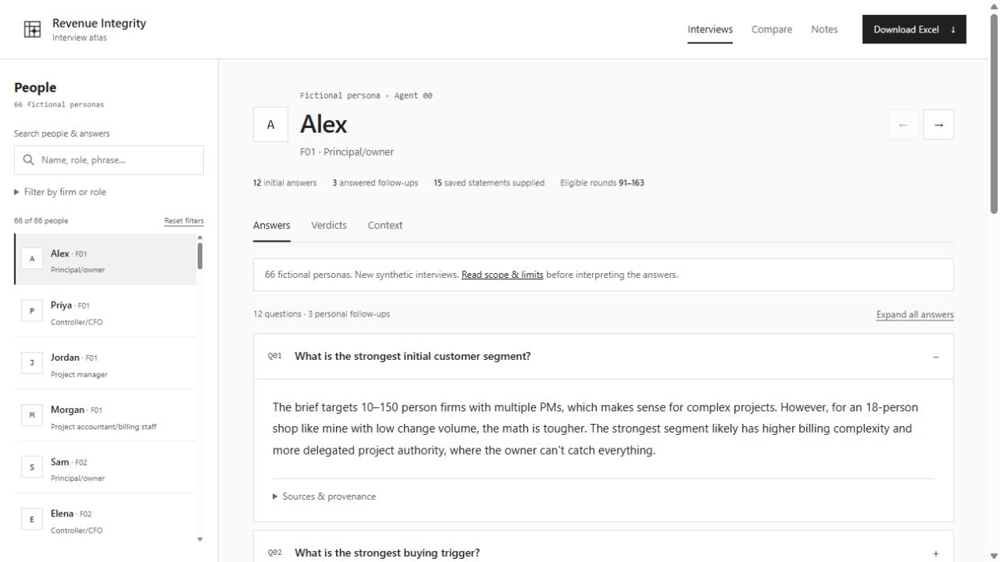

# Revenue Integrity Interview Atlas

A minimalist, square-edged reader for the completed Revenue Integrity A&E interview workbook. Read by person, compare exact answers, and open the original context without a dashboard getting in the way.

[Open the live atlas](https://divitmehta123.github.io/revenue-integrity-interview-atlas/)



**The 66 people are fictional. These are synthetic roleplay interviews, not customer research or proof of market demand.** Read [Scope and limits](https://divitmehta123.github.io/revenue-integrity-interview-atlas/#view=scope) in the reader before interpreting responses. All original workbook scope notes are reproduced verbatim.

## Open the reader

Download or clone the repository and open **`index.html`** in a modern browser. No installation, API key, internet connection, or model call is needed. Keep the `data` and `assets` folders beside the HTML file.

For a local server:

```sh
python -m http.server 8766
```

Then open `http://localhost:8766`.

## What is included

### Redesigned Excel

[Download the visual workbook](data/Revenue_Integrity_Interview_Atlas_Visual.xlsx). It adds three reading views before the five complete original tables:

- **Overview** — three native, editable charts: assigned-role participation, saved statements by firm, and current-phase records by round. Counts are formula-linked to the preserved source tables, never treated as demand or adoption estimates.
- **Reader** — choose an agent ID and question ID to read the exact question, answer, basis, sources, uncertainty, cautions and provenance alongside the separate persona and analyst verdicts. `Q01`–`Q12` are initial questions; `F01`–`F03` are personal follow-ups.
- **Network** — a print-quality, boxy diagram of all 66 fictional personas, plus an exact filterable table of all 146 directed assigned relationships. The schematic shows same-firm links; the table retains cross-firm and client links. The graph is an embedded diagram, not an editable native chart. Four unconnected personas are retained.

The five original tables retain all their populated cells verbatim. The original XLSX itself remains byte-for-byte unchanged. The redesigned copy adds only presentation, linked calculations, controls and the extracted relationship view. Agent 0, a middle agent and agent 65, blank/invalid selectors, and chart dependency updates were checked in the authoring engine. Native Excel application interaction was not separately tested.

### Graphify relationship view

[Open the full graph](graphify-out/graph.html), [raw graph JSON](graphify-out/graph.json), or [the graph audit](graphify-out/GRAPH_REPORT.md). The curated corpus was only the saved fictional relationship fields—not the whole workspace, private logs, API credentials, or a fresh interpretation of interview opinions. All 146 directed links are EXTRACTED and independently checked against `Personas!J7:J72`. Communities/cohesion describe the undirected assigned topology, not buying intent or semantic agreement. The graph audit is not a business report.

The visualization uses a locally vendored, integrity-checked **vis-network 9.1.6** library. It works offline and makes no CDN or model-provider requests. Its MIT and Apache 2.0 licenses are included in `graphify-out/vendor/`; those upstream licenses apply to that library. Graphify is credited at [safishamsi/graphify](https://github.com/safishamsi/graphify).

### Website navigation

The reader opens directly to an interview. The main navigation is **Interviews / Compare / Notes**, and each person has **Answers / Verdicts / Context**. Context leads to the profile, original records and exact prompts. Source, caution and provenance detail is disclosed on demand; no text has been removed.

| View           | Contents                                                                                              |
| -------------- | ----------------------------------------------------------------------------------------------------- |
| People         | 66 fictional profiles, their 12 initial answers and 3 answered adaptive follow-ups                    |
| By question    | Exact answers to each shared question across all people; firm, role, and phrase filters               |
| Verdicts       | 66 persona verdicts and 66 separately authored analyst interpretations                                |
| Sources        | 1,248 complete eligible saved statements and 45 full brief sections, including its introduction       |
| Exact prompts  | The full ordered messages for 132 accepted interview stages                                           |
| Scope & limits | Original notes about fictional inputs, interventions, excluded phases, uncertainty, and comparability |

The statement-window visual and new Excel charts describe **coverage only**, not demand, adoption rates, or validated market statistics. A window spans the first and last eligible own statements across both platforms; it does not imply continuous participation. All saved persona recommendations are “Narrow”; the redesign does not manufacture contrasting verdicts to make a chart.

All 168 rounds on each simulation platform were scanned. Only `connected_product_evaluation_v2` supplies persona opinion history. Older phases remain excluded as specified in the original workbook. Each persona received all of their eligible own statements, not only rounds 109–111. The atlas adds no new interviews or business conclusions.

## Content preservation

- `data/Revenue_Integrity_66_Agent_Interviews.xlsx` is the **unchanged original workbook**.
- `data/workbook.json` retains every populated workbook cell, including off-table notes, exact questions, answers, verdicts, cautions, profiles, source parts, and prompt parts.
- `data/workbook.js` contains identical data in a script wrapper for offline use.
- The reader joins source and prompt parts in their original order. It never paraphrases answers. Collapsed panels and pagination only change presentation; the full text remains available.
- Model names, reasoning effort, UTC interview times, basis, source IDs, uncertainty, and follow-up reasons remain accessible.

Original workbook SHA-256:

```text
49647106a3513aae0ff53f7c70f230e29a3dabd2cfc751f7de02df569e64815e
```

Verify content and release safety with Python 3.9+:

```sh
python tools/verify_data.py
python tools/verify_visual.py
```

Re-extract the included original workbook with Python 3.9+:

```sh
python tools/build_data.py
```

The static reader is plain HTML, CSS, and JavaScript. No dependency or build system is required. The verification suite independently compares every populated XLSX cell with the JSON representation and checks all interview, source, prompt, and scope counts.

## Provenance and limitations

The recorded history comes from a fictional MiroFish simulation. The supplied product brief is unverified concept/research material, not independently checked vendor capability or market evidence. New interview answers are model-generated interpretations of assigned profiles and eligible saved statements. Source IDs are context, not proof of new claims or real purchases.

Two redesign interventions, exact trace boundaries, excluded older responses, unequal observation windows, later grounding/recovery pauses, and prompt/model refinements limit inference and comparability. Preserved unsupported statements carry their original cautions. Vendor personas are not actual vendor statements. See the complete original notes in the reader and workbook.

No simulation rerun, report generation, cloud-graph operation, or source-history edit was performed to create this reader. Original simulation databases, raw recovery logs, server settings, local file paths, and API credentials are not part of this release.

## Privacy and security

The reader makes no API requests and includes no analytics, external fonts, tracking, credentials, or persistent storage. All data is shipped as a public corpus. Text is escaped before display; source text and prompts are never executed. See [SECURITY.md](SECURITY.md).

## Contributing

Interface, accessibility, and navigation improvements are welcome. Keep corpus text and the original workbook unchanged unless a separately reviewed, clearly versioned dataset change is intended. Run the content verifier after reader changes. See [CONTRIBUTING.md](CONTRIBUTING.md).

## License

This repository is released under the [MIT License](LICENSE). Synthetic statements and unverified brief claims remain unchanged; the license does not make them validated facts, vendor endorsements, or guarantees.
